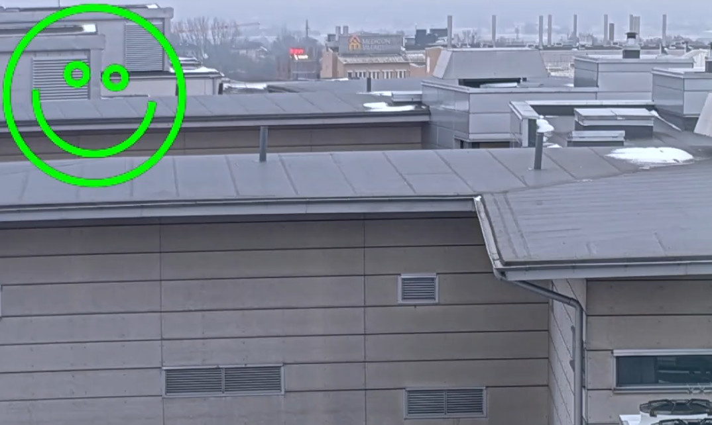

*Copyright (C) 2026, Axis Communications AB, Lund, Sweden. All Rights Reserved.*

# ACAP application drawing video overlays with GPU acceleration

This README file explains how to build an ACAP application that uses the Axoverlay2 API with GPU acceleration.

This example shows how to leverage GPU acceleration with the [Skia 2D graphics library](https://skia.org). Graphics acceleration significantly increases throughput and power efficiency in many use cases, compared to CPU-based rendering. Skia is a popular modern open-source toolkit suitable for many applications. This example can also serve as a starting point if you wish to integrate Axoverlay with another graphics toolkit.

Together with this README file, you should be able to find a directory called app. That directory contains the "axoverlay2_skia" application source code which can easily be compiled and run with the help of the tools and step by step below.

For more information on Axoverlay2 API, please see the [Axis developer documentation](https://developer.axis.com/acap/reference/supported-apis/#axoverlay-2-api)

## Getting started

These instructions will guide you on how to execute the code. Below is the structure used in the example:

```sh
axoverlay2_skia
├── app
│   ├── axoverlay2_skia.cc
│   ├── axo2_wrappers.hh
│   ├── gpu_error.hh
│   ├── LICENSE
│   ├── Makefile
│   └── manifest.json
├── Dockerfile
└── README.md
```

- **app/axoverlay2_skia.cc** - Application to draw overlays using axoverlay 2.0 and Skia in C++.
- **app/axo2_wrappers.hh** - C++ wrappers for the axoverlay2 API.
- **app/gpu_error.hh** - GPU error handling utilities.
- **app/LICENSE** - Text file that lists all open source licensed source code distributed with the application.
- **app/Makefile** - Build and link instructions for the application.
- **app/manifest.json** - Defines the application and its configuration.
- **Dockerfile** - Assembles an image that downloads and builds the Skia graphics library and the ACAP application using the ACAP Native SDK.
- **README.md** - Step-by-step instructions on how to run the example.

### Supported devices

- ARTPEC-9, ARTPEC-8, and ARTPEC-7 based cameras and other video devices.
- GPU support (OpenGL/EGL) must be available for application use on the device. Please refer to
  [Axis developer documentation](https://developer.axis.com/acap/api/api-compatibility-guide/) for details.

## Build the application

Standing in your working directory, run the following commands:

> [!NOTE]
>
> Depending on the network your local build machine is connected to, you may need to add proxy
> settings for Docker. See
> [Proxy in build time](https://developer.axis.com/acap/develop/proxy/#proxy-in-build-time).

```sh
docker build --tag axoverlay2_skia --build-arg ARCH=<ARCH> .
```

- `<ARCH>` is the architecture of the camera you are using, e.g., `aarch64` or `armv7hf`

> [!NOTE]
>
> The first build downloads and compiles the Skia graphics library, which takes a while. Subsequent
> builds reuse the cached Skia layers, so rebuilds after editing the application source are fast.

Copy the result from the container image to a local directory `build`:

```sh
docker cp $(docker create axoverlay2_skia):/opt/app ./build
```

The built ACAP application is now available in the `build` directory. Depending on which SDK
architecture was chosen, one of these files should be found:

- `Axoverlay2_example_Skia_application_1_0_0_aarch64.eap`
- `Axoverlay2_example_Skia_application_1_0_0_armv7hf.eap`

> [!NOTE]
>
> For detailed information on how to build, install, and run ACAP applications, refer to the official ACAP documentation: [Build, install, and run](https://developer.axis.com/acap/develop/build-install-run/).

## Install and start the application

Browse to the application page of the Axis device:

```sh
http://<AXIS_DEVICE_IP>/index.html#apps
```

1. Click on the tab **Apps** in the device GUI
2. Enable the **Allow unsigned apps** toggle
3. Click the **(+ Add app)** button to upload the application file
4. Select the newly built application package, depending on architecture:

   - `axoverlay2_skia_1_0_0_aarch64.eap`
   - `axoverlay2_skia_1_0_0_armv7hf.eap`

5. Click **Install**
6. Run the application by enabling the **Start** switch.

## Expected output



While the application is running, a rotating and colour-shifting icon should appear in the top-left
corner of video streams.

The application log can be found directly at:

```sh
http://<AXIS_DEVICE_IP>/axis-cgi/admin/systemlog.cgi?appname=axoverlay2_skia
```

During normal operation, the application prints log entries for each connecting and disconnecting
video stream:

```text
axoverlay2_skia[2095]: Created overlay 1 on stream 1041, stream_size=3840x2160 overlay_used_size=135x135 overlay_full_size=136x136
axoverlay2_skia[2095]: Removed overlay 1 from stream 1041
```

In addition, the code contains some debug prints which may be enabled using the DEBUG flag found in
axoverlay2_skia.cc.

## License

**[MIT](app/LICENSE)**
