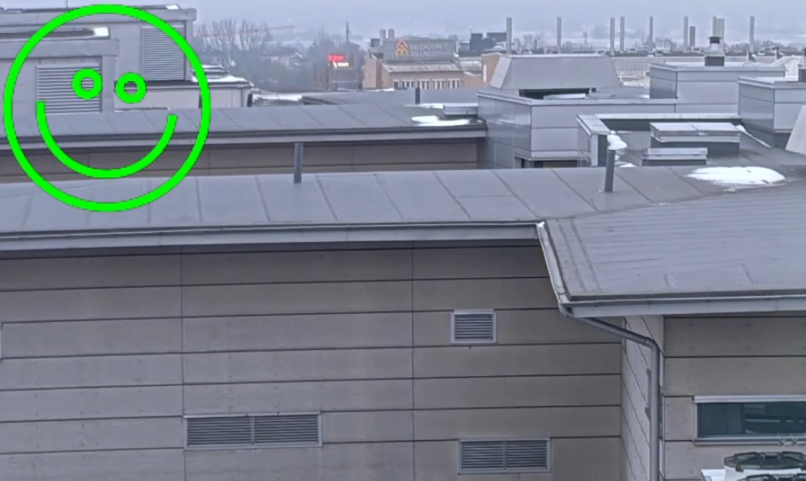

*Copyright (C) 2026, Axis Communications AB, Lund, Sweden. All Rights Reserved.*

# ACAP application drawing video overlays

This README file explains how to build an ACAP application that uses the axoverlay API, version 2.0.

Together with this README file, you should be able to find a directory called app. That directory contains the "axoverlay2" application source code which can easily be compiled and run with the help of the tools and step by step below.

For more information on Axoverlay2 API, please see the [Axis developer documentation](https://developer.axis.com/acap/4/api/#axoverlay2-api).

This example illustrates how to draw overlays in a video stream and Cairo is used as rendering API, see [documentation](https://www.cairographics.org/). In this example, a rotating and color-shifting icon is drawn.

## Getting started

These instructions will guide you on how to execute the code. Below is the structure and scripts used in the example:

```sh
axoverlay2
├── app
│   ├── axoverlay2.c
│   ├── LICENSE
│   ├── Makefile
│   └── manifest.json
├── Dockerfile
└── README.md
```

- **app/axoverlay2.c** - Application to draw overlays using axoverlay 2.0 in C.
- **app/LICENSE** - Text file that lists all open source licensed source code distributed with the application.
- **app/Makefile** - Build and link instructions for the application.
- **app/manifest.json** - Defines the application and its configuration.
- **Dockerfile** - Assembles an image containing the ACAP Native SDK and builds the application using it.
- **README.md** - Step-by-step instructions on how to run the example.

### Supported devices

- ARTPEC-9, ARTPEC-8, and ARTPEC-7 based cameras and other video devices.

## Build the application

Standing in your working directory, run the following commands:

> [!NOTE]
>
> Depending on the network your local build machine is connected to, you may need to add proxy
> settings for Docker. See
> [Proxy in build time](https://developer.axis.com/acap/develop/proxy/#proxy-in-build-time).

```sh
docker build --platform=linux/amd64 --tag <APP_IMAGE> --build-arg ARCH=<ARCH> .
```

- `<APP_IMAGE>` is the name to tag the image with, e.g., `axoverlay2:1.0`
- `<ARCH>` is the architecture of the camera you are using, e.g., `armv7hf` (default) or `aarch64`

Copy the result from the container image to a local directory called `build`:

```sh
docker cp $(docker create --platform=linux/amd64 <APP_IMAGE>):/opt/app ./build
```

The `build` directory contains the build artifacts, where the ACAP application
is found with suffix `.eap`, depending on which SDK architecture that was
chosen, one of these files should be found:

- `Axoverlay2_example_application_1_0_0_aarch64.eap`
- `Axoverlay2_example_application_1_0_0_armv7hf.eap`

> [!NOTE]
>
> For detailed information on how to build, install, and run ACAP applications, refer to the official ACAP documentation: [Build, install, and run](https://developer.axis.com/acap/develop/build-install-run/).

## Install and start the application

Browse to the application page of the Axis device:

```sh
http://<AXIS_DEVICE_IP>/index.html#apps
```

1. Click on the tab **Apps** in the device GUI
2. Enable the **Allow unsigned apps** toggle
3. Click the **(+ Add app)** button to upload the application file
4. Select the newly built application package, depending on architecture:

   - `Axoverlay2_example_application_1_0_0_aarch64.eap`
   - `Axoverlay2_example_application_1_0_0_armv7hf.eap`

5. Click **Install**
6. Run the application by enabling the **Start** switch.

## Expected output



While the application is running, a rotating and colour-shifting icon should appear in the top-left
corner of video streams.

The application log can be found directly at:

```sh
http://<AXIS_DEVICE_IP>/axis-cgi/admin/systemlog.cgi?appname=axoverlay2
```

During normal operation, the application prints log entries for each connecting and disconnecting
video stream:

```text
axoverlay2[2095]: Created overlay 1 on stream 1041, stream_size=3840x2160 overlay_used_size=135x135 overlay_full_size=136x136
axoverlay2[2095]: Removed overlay 1 from stream 1041
```

In addition, the code contains some debug prints which may be enabled using the DEBUG flag found in
axoverlay2.c.

## License

**[MIT](../LICENSE)**
