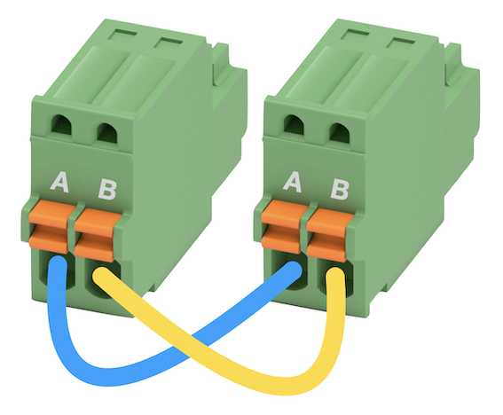

# How to communicate with serial ports in an ACAP application

This guide explains how to build an ACAP application that uses the axserialport API. This example illustrates how to enable the serial port and set configuration parameters with the API. Additionally, it uses the [GLib IOChannel](https://docs.gtk.org/glib/struct.IOChannel.html)'s methods to communicate between two available ports in the Axis product.

This program requires a serial loopback cable in order to function properly. This is how it should look like:


## Getting started

These instructions will guide you on how to execute the code. Below is the structure and scripts used in the example:

```sh
axserialport
├── app
│   ├── axserialport.c
│   ├── LICENSE
│   ├── Makefile
│   └── manifest.json
├── Dockerfile
└── README.md
```

- **app/axserialport.c** - Application to show API in C.
- **app/LICENSE** - Text file which lists all open source licensed source code distributed with the application.
- **app/Makefile** - Makefile containing the build and link instructions for building the ACAP application.
- **app/manifest.json** - Defines the application and its configuration.
- **Dockerfile** - Docker file with the specified Axis toolchain and API container to build the example specified.
- **README.md** - Step by step instructions on how to run the example.

### How to run the code

Below is the step by step instructions on how to execute the program. So basically starting with the generation of the .eap file to running it on a device.

#### Build the application

Standing in your working directory run the following commands:

> [!NOTE]
>
> Depending on the network your local build machine is connected to, you may need to add proxy
> settings for Docker. See
> [Proxy in build time](https://developer.axis.com/acap/develop/proxy/#proxy-in-build-time).

```sh
docker build --platform=linux/amd64 --tag <APP_IMAGE> .
```

`<APP_IMAGE>` is the name to tag the image with, e.g., `axserialport:1.0`

Default architecture is **armv7hf**. To build for **aarch64** it's possible to
update the *ARCH* variable in the Dockerfile or to set it in the `docker build`
command via build argument:

```sh
docker build --build-arg ARCH=aarch64 --tag <APP_IMAGE> .
```

Copy the result from the container image to a local directory called `build`:

```sh
docker cp $(docker create --platform=linux/amd64 <APP_IMAGE>):/opt/app ./build
```

The working directory now contains a build folder with the following files:

```sh
axserialport
build
├── Makefile
├── manifest.json
├── package.conf
├── package.conf.orig
├── param.conf
├── axserialport*
├── axserialport_1_0_0_armv7hf.eap
├── axserialport_1_0_0_LICENSE.txt
├── axserialport.c
└── LICENSE
```

- **manifest.json** - Defines the application and its configuration.
- **package.conf** - Defines the application and its configuration.
- **package.conf.orig** - Defines the application and its configuration, original file.
- **param.conf** - File containing additional application parameters.
- **axserialport*** - Application executable binary file.
- **axserialport_1_0_0_armv7hf.eap** - Application package .eap file.
- **axserialport_1_0_0_LICENSE.txt** - Copy of LICENSE file.

> [!NOTE]
>
> For detailed information on how to build, install, and run ACAP applications, refer to the official ACAP documentation: [Build, install, and run](https://developer.axis.com/acap/develop/build-install-run/).

#### Install and start the application

Browse to the application page of the Axis device:

```sh
http://<AXIS_DEVICE_IP>/index.html#apps
```

- Click on the tab `Apps` in the device GUI
- Enable `Allow unsigned apps` toggle
- Click `(+ Add app)` button to upload the application file
- Browse to the newly built ACAP application, depending on architecture:
  - `axserialport_1_0_0_aarch64.eap`
  - `axserialport_1_0_0_armv7hf.eap`
- Click `Install`
- Run the application by enabling the `Start` switch

#### The expected output

Application log can be found directly at `http://<AXIS_DEVICE_IP>/axis-cgi/admin/systemlog.cgi?appname=axserialport` or by clicking on the "**App log**" link in the device GUI.

```sh
----- Contents of SYSTEM_LOG for 'axserialport' -----
11:39:55.366 [ INFO ] axserialport[1423]: Starting AxSerialPort application
11:40:09.784 [ NOTICE  ] axserialport[1423]: incoming_data() timestamp: 00:10
11:40:09.784 [ NOTICE  ] axserialport[1423]: send_timer_data() wrote 2 bytes, status:'G_IO_STATUS_NORMAL'
11:40:19.784 [ NOTICE  ] axserialport[1423]: incoming_data() timestamp: 00:20
11:40:19.784 [ NOTICE  ] axserialport[1423]: send_timer_data() wrote 2 bytes, status:'G_IO_STATUS_NORMAL'
...
```

## License

**[Apache License 2.0](../LICENSE)**
