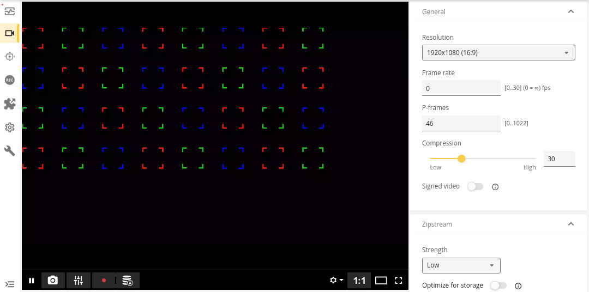
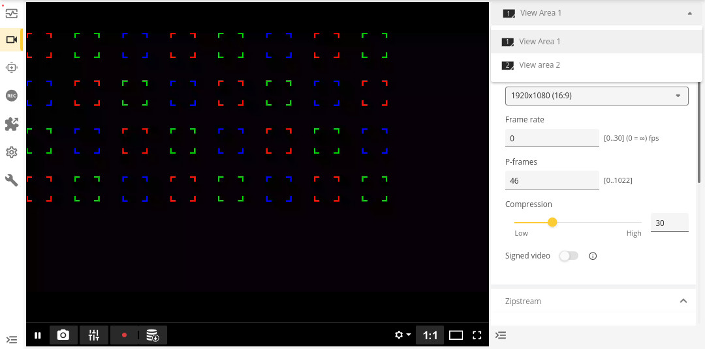

*Copyright (C) 2024, Axis Communications AB, Lund, Sweden. All Rights Reserved.*

# ACAP application drawing bounding boxes

This example demonstrates how to draw burnt-in bounding boxes on selected video sources/channels using the [Bounding Box](https://developer.axis.com/acap/api/native-sdk-api/#bounding-box-api) API.

The aim of this API is to solve one common use-case, supporting all new chips in Axis products and utilizing the most optimized drawing mechanism available for each chip. Meanwhile, the Axoverlay API which is show-cased in the [axoverlay](../axoverlay) example exposes advanced ARTPEC specific overlay functionality.

## Project structure

The files for building the application are organized in the following structure.

```sh
bounding-box
├── app
│   ├── bounding_box_example.c
│   ├── LICENSE
│   ├── Makefile
│   └── manifest.json
├── Dockerfile
└── README.md
```

- **app/bounding_box_example.c** - Application source code.
- **app/LICENSE** - List of all open source licensed source code distributed with the application.
- **app/Makefile** - Build and link instructions for the application.
- **app/manifest.json** - Definition of the application and its configuration.
- **Dockerfile** - Assembles an image containing the ACAP SDK toolchain and builds the application using it.
- **README.md** - Step by step instructions on how to run the example.

## Program structure and behavior

The program alternates between three different states.

- Draw 3 boxes on view area 1 (coordinates relative to the view area)
- Draw 32 boxes on view areas 1 and 2 (coordinates relative to full view)
- Draw nothing

A [view area](https://www.axis.com/vapix-library/subjects/t10175981/section/t10156183/display?section=t10156183-t10156183) is a virtual channel, that can either be the full view or a cropped view. A view area is always referred to with a unique number. There will always be at least one view per sensor.

Multiple streams can be created from the same view area, but the same boxes will be drawn on all of the streams. For instance you can have one view area dedicated to live streams with bounding boxes and another view area dedicated to recording streams without any bounding boxes.

The typical use-case is to analyze the full view of the camera also referred to as [input](https://developer.axis.com/acap/api/src/api/vdostream/html/vdo-stream_8h.html). The benefit with this approach is that you can draw boxes around the detected objects in any number of view areas, see `bbox_new`.

However using the view areas feature it's possible to predefine a cropped region of interest, this might result in higher framerates as uninteresting parts of the image are discarded. The trade-off is that bounding boxes can then only be drawn in that single view area, see `bbox_view_new`.

## Build the application

Standing in your working directory run the following commands:

> [!NOTE]
>
> Depending on the network your local build machine is connected to, you may need to add proxy
> settings for Docker. See
> [Proxy in build time](https://developer.axis.com/acap/develop/proxy/#proxy-in-build-time).

```sh
docker build --platform=linux/amd64 --tag <APP_IMAGE> --build-arg ARCH=<ARCH> .
```

- `<APP_IMAGE>` is the name to tag the image with, e.g., `bbox:1.0`
- `<ARCH>` is the SDK architecture, `armv7hf` or `aarch64`.

Copy the result from the container image to a local directory `build`:

```sh
docker cp $(docker create --platform=linux/amd64 <APP_IMAGE>):/opt/app ./build
```

The `build` directory contains the build artifacts, where the ACAP application
is found with suffix `.eap`, depending on which SDK architecture that was
chosen, one of these files should be found:

- `AXIS_Bounding_Box_Example_1_0_0_aarch64.eap`
- `AXIS_Bounding_Box_Example_1_0_0_armv7hf.eap`

> [!NOTE]
>
> For detailed information on how to build, install, and run ACAP applications, refer to the official ACAP documentation: [Build, install, and run](https://developer.axis.com/acap/develop/build-install-run/).

## Install and start the application

Browse to the application page of the Axis device:

```sh
http://<AXIS_DEVICE_IP>/index.html#apps
```

- Click on the tab `Apps` in the device GUI
- Enable `Allow unsigned apps` toggle
- Click `(+ Add app)` button to upload the application file
- Browse to the newly built ACAP application, depending on architecture:
  - `AXIS_Bounding_Box_Example_1_0_0_aarch64.eap`
  - `AXIS_Bounding_Box_Example_1_0_0_armv7hf.eap`
- Click `Install`
- Run the application by enabling the `Start` switch

## Expected output

The three alternating states of bounding boxes are visible in the video stream that can be accessed on:

```sh
http://<AXIS_DEVICE_IP>/index.html#video/stream
```

It's recommended to experiment with two view areas that can be set in the web interface on

```sh
http://<AXIS_DEVICE_IP>/index.html#video/viewareas
```

and compare the different output in the video stream for the two view areas.

Expected image for cameras with one sensor without any extra view areas.



Expected image for cameras with one sensor and view areas enabled. The selector which can be seen in the top-right corner of the image uses the same numbering as the `bbox_new` and `bbox_view_new` APIs.



After the first iteration, a log of success should be logged in the application log.

The application log can be found by either

- Browsing to `http://<AXIS_DEVICE_IP>/axis-cgi/admin/systemlog.cgi?appname=bounding_box_example`.
- Browsing to the *Apps* page and select `App log`.

```text
[ INFO    ] bounding_box_example[12345]: All examples succeeded.
```

## License

**[Apache License 2.0](../LICENSE)**
