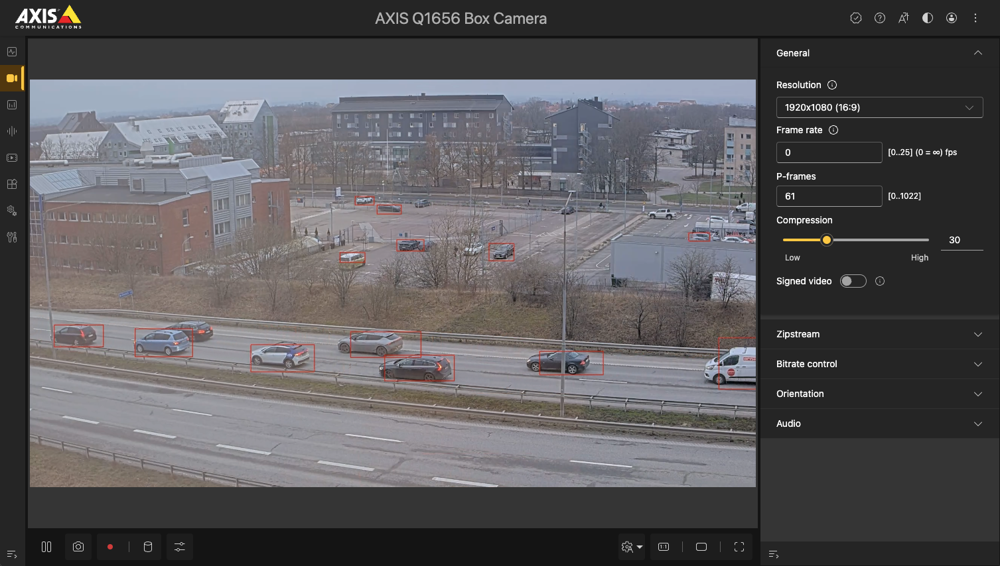

*Copyright (C) 2025, Axis Communications AB, Lund, Sweden. All Rights Reserved.*

<!-- omit from toc -->
# Object detection with YOLOv5

This example shows how to apply a YOLOv5 object detection model on an Axis camera. Emphasis has
been put on explaining how to parse the output of the model, but also to show how to draw bounding
boxes on the stream.

This example uses the following APIs:

- [Machine learning API (Larod)](https://developer.axis.com/acap/api/native-sdk-api/#machine-learning-api-larod)
- [Video capture API (VDO)](https://developer.axis.com/acap/api/native-sdk-api/#video-capture-api-vdo)
- [Bounding Box API](https://developer.axis.com/acap/api/native-sdk-api/#bounding-box-api)
- [Parameter API](https://developer.axis.com/acap/api/native-sdk-api/#parameter-api)

Below is an example showing how the bounding boxes are drawn around the detected objects on the
stream.



## Project structure

The files for building the application are organized in the following structure.

```sh
object-detection-yolov5
├── app
│   ├── argparse.c
│   ├── argparse.h
│   ├── imgprovider.c
│   ├── imgprovider.h
│   ├── labelparse.c
│   ├── labelparse.h
│   ├── LICENSE
│   ├── Makefile
│   ├── manifest.json.artpec9
│   ├── manifest.json.artpec8
│   ├── manifest.json.cpu
│   ├── model.c
│   ├── model.h
│   ├── object_detection_yolov5.c
│   ├── panic.c
│   ├── panic.h
│   └── parameter_finder.py
├── Dockerfile
└── README.md
```

- **app/argparse.c/h** - Program argument parser.
- **app/imgprovider.c/h** - Implementation of VDO parts.
- **app/labelparse.c/h** - Parse file of labels.
- **app/LICENSE** - Text file which lists all open source licensed source code distributed with the
application.
- **app/Makefile** - Makefile containing the build and link instructions for building the ACAP
application.
- **app/manifest.json.artpec9** - Defines the application and its configuration when building for
ARTPEC-9 DLPU with TensorFlow Lite.
- **app/manifest.json.artpec8** - Defines the application and its configuration when building for
ARTPEC-8 DLPU with TensorFlow Lite.
- **app/manifest.json.cpu** - Defines the application and its configuration when building for
CPU with TensorFlow Lite.
- **app/object_detection_yolov5.c** - Application source code in C.
- **app/model.c/h** - Implementation of Larod parts.
- **app/panic.c/h** - Utility for exiting the program on error.
- **app/parameter_finder.py** - Python script to create `model_params.h`, containing model specific
parameters.
- **Dockerfile** - Docker file with the specified Axis toolchain and API container to build the
example specified.
- **README.md** - Step by step instructions on how to run the example.

<!-- omit from toc -->
## Table of contents

- [Project structure](#project-structure)
- [Outline of example](#outline-of-example)
- [Train YOLOv5](#train-yolov5)
- [Explanation of YOLOv5 output parsing](#explanation-of-yolov5-output-parsing)
  - [Output shape](#output-shape)
  - [Dequantization](#dequantization)
  - [Filtering](#filtering)
    - [Compare object likelihood to confidence threshold](#compare-object-likelihood-to-confidence-threshold)
    - [Non-Maximum Suppression (NMS)](#non-maximum-suppression-nms)
- [ACAP application parameters](#acap-application-parameters)
  - [AXParameter parameters](#axparameter-parameters)
  - [Dockerfile parameters](#dockerfile-parameters)
  - [Model-specific parameters](#model-specific-parameters)
- [Build the application](#build-the-application)
- [Install and start the application](#install-and-start-the-application)
- [Expected output](#expected-output)
  - [Application log](#application-log)
- [License](#license)

## Outline of example

1. Retrieve parameters using the
[Parameter API](https://developer.axis.com/acap/api/native-sdk-api/#parameter-api).
2. Start a thread for continuously fetching frames with
[Video capture API (VDO)](https://developer.axis.com/acap/api/native-sdk-api/#video-capture-api-vdo).
3. Create two Larod jobs with
[Machine learning API (Larod)](https://developer.axis.com/acap/api/native-sdk-api/#machine-learning-api-larod):
    - Pre-processing job.
    - Model inference job.
4. Setup the style of bounding boxes using the
[Bounding Box API](https://developer.axis.com/acap/api/native-sdk-api/#bounding-box-api).
5. Run the main program loop:
    1. Fetch image data from VDO.
    2. Convert image data to the correct format with the Larod pre-processing job.
    3. Run inference with the Larod model inference job.
    4. Perform YOLOv5-specific parsing of the output.
    5. Draw bounding boxes and log details about the detected objects.

## Train YOLOv5

This example uses a YOLOv5n model trained on the [COCO dataset](https://cocodataset.org/). Depending
on which `<CHIP>` is provided when [building the application](#build-the-application), either
[yolov5n_artpec8_coco_640.tflite](https://acap-ml-models.s3.us-east-1.amazonaws.com/yolov5/yolov5n_artpec8_coco_640.tflite)
or [yolov5n_artpec9_coco_640.tflite](https://acap-ml-models.s3.us-east-1.amazonaws.com/yolov5/yolov5n_artpec9_coco_640.tflite)
is used. The differences between these models are explained in their respective training guide:

- [YOLOv5 on ARTPEC-8](https://github.com/AxisCommunications/axis-model-zoo/blob/main/docs/yolov5-on-artpec8.md).
- [YOLOv5 on ARTPEC-9](https://github.com/AxisCommunications/axis-model-zoo/blob/main/docs/yolov5-on-artpec9.md).

To train your own YOLOv5 model, follow the appropriate guide above.

## Explanation of YOLOv5 output parsing

This section provides a detailed explanation of the YOLOv5-specific output parsing applied in this
example. The [output shape](#output-shape) section describes the shape of the output and the meaning
of each element within the output array. Following that, the [dequantization](#dequantization)
section explains the process of converting the output into meaningful values. Lastly, the
[Filtering](#filtering) section describes how the output is filtered to exclude invalid detections.

### Output shape

The output is an array of `Nx(5+C)` elements of type `uint8_t`, where:

- `N` is a fixed number of detections (typically 25200).
- `C` is the number of classes specified in training.

For each detection, `N`, there are `(5+C)` elements, which are represented like this:

`[x, y, w, h, object_likelihood, class1_likelihood, class2_likelihood, class3_likelihood, ... ]`

- `x` and `y` are the center coordinates of the bounding box.
- `w` and `h` are the width and height of the bounding box.
- `object_likelihood` is the probability that this detection is "something".
- `classX_likelihood` is the probability that the detection is of class X.

However, before being able to acquire the correct values from the output, each individual
element must be [dequantized](#dequantization).

### Dequantization

The model has to be quantized to be able to run on the ARTPEC-8 or ARTPEC-9 DLPU. Many models
include a dequantization step in the final stages of the model, which means that the output will be
formatted in a meaningful manner. However, this is not the case for YOLOv5. For more information
about quantization, see the documentation for
[quantization](https://developer.axis.com/computer-vision/computer-vision-on-device/quantization).

Since the output of YOLOv5 is quantized, the elements must be dequantized in order to correctly
parse the output. For this, two quantization parameters, `quantization_zero_point` and
`quantization_scale`, must be acquired from the model. These parameters depend on the model and
will not change unless the model changes. Therefore, both of the quantization parameters are
picked up at build time through the `parameter_finder.py` script, as described in
[Model-specific parameters](#model-specific-parameters).

To dequantize an element, it first has to be shifted with `quantization_zero_point`, and then scaled
with `quantization_scale`. For instance, to dequantize the `object_likelihood` for the `i`th
detection, the following expression is required:

```c
float object_likelihood = (output_tensor[(5+C) * i + 4] - quantization_zero_point) * quantization_scale;
```

After the dequantization, `object_likelihood` will be a float in the range `[0.0,1.0]`, where a
value close to `0.0` indicates low likelihood, and a value close to `1.0` indicates high likelihood.

### Filtering

As mentioned in the [Output shape](#output-shape) section, the output is always an array with a
fixed number of detections, `N`. However, most of these detections are not valid. Therefore, the
output must be filtered in order to find the valid detections.

The filtering is performed by initially comparing the `object_likelihood` of all detections to a
confidence threshold, `conf_threshold`. Following that, a non-maximum suppression (NMS) algorithm is
applied to filter out detections with overlapping bounding boxes.

#### Compare object likelihood to confidence threshold

In this step of the filtering, the `object_likelihood` of each detection is compared to the
confidence threshold, `conf_threshold`. If the `object_likelihood` is lower than `conf_threshold`,
that detection is marked as invalid. By applying this filter, detections with an insufficient
`object likelihood` are discarded.

#### Non-Maximum Suppression (NMS)

The purpose of applying NMS is to discard detections with overlapping bounding boxes. Ideally, only
a single detection will remain per object.

In this algorithm, all detections are compared against each other. If the
`Intersection over Union (IoU)` score between two detections is higher than the `iou_threshold`, the
detection with the lowest `object_likelihood` is marked as invalid. The `IoU` score is high when the
bounding boxes overlap a lot, and low when they overlap a little.

## ACAP application parameters

### AXParameter parameters

The following parameters are set through the *Settings* dialog when the ACAP application is
installed. In order to apply the changes, the ACAP application must be restarted.

- **Conf threshold percent** - Integer between 0 and 100 used as `conf_threshold` in the
[Filtering](#filtering) section.
- **Iou threshold percent** - Integer between 0 and 100 used as `iou_threshold` in the
[Filtering](#filtering) section.

### Dockerfile parameters

The model `.tflite` file and the labels `.txt` file are provided through the `Dockerfile`. In this
example, these files are downloaded using the `curl` command.

### Model-specific parameters

The Python script `parameter_finder.py` is run by the `Dockerfile` before building
the ACAP application. Its purpose is to automatically create a `.h` file containing model-specific
parameters collected from the `.tflite` file. The `.h` file will contain the following parameters:

- **MODEL_INPUT_HEIGHT** - The input height expected by the model.
- **MODEL_INPUT_WIDTH** - The input width expected by the model.
- **QUANTIZATION_SCALE** - The quantization scale used for dequantization.
- **QUANTIZATION_ZERO_POINT** - The quantization zero point used for dequantization.
- **NUM_CLASSES** - The number of classes the model outputs.
- **NUM_DETECTIONS** - The number of detections the model outputs.

## Build the application

Standing in your working directory run the following commands:

> [!NOTE]
>
> - Depending on the network your local build machine is connected to, you may need to add proxy
> settings for Docker. See
> [Proxy in build time](https://developer.axis.com/acap/develop/proxy).
>
> - To comply with the [licensing terms of Ultralytics](https://github.com/ultralytics/yolov5?tab=readme-ov-file#license),
> the YOLOv5 model file integrated into this ACAP application is licensed under AGPL-3.0-only. See [LICENSE](app/LICENSE).

```sh
docker build --tag <APP_IMAGE> --build-arg ARCH=<ARCH> --build-arg CHIP=<CHIP> .
```

- `<APP_IMAGE>` is the name to tag the image with, e.g., `object_detection_yolov5:1.0`.
- `<ARCH>` is the SDK architecture, `armv7hf` or `aarch64`.
- `<CHIP>` is the chip type, `artpec9`, `artpec8`, or `cpu`.

Copy the result from the container image to a local directory `build`:

```sh
docker cp $(docker create <APP_IMAGE>):/opt/app ./build
```

The `build` directory contains the build artifacts, where the ACAP application is found with suffix
`.eap`, depending on which architecture and chip chosen:

- `object_detection_yolov5_<CHIP>_1_0_0_<ARCH>.eap`.

## Install and start the application

Browse to the application page of the Axis device:

```sh
http://<AXIS_DEVICE_IP>/index.html#apps
```

- Click on the tab `Apps` in the device GUI
- Enable `Allow unsigned apps` toggle
- Click `(+ Add app)` button to upload the application file
- Browse to the newly built ACAP application:
  - `object_detection_yolov5_<CHIP>_1_0_0_<ARCH>.eap`
- Click `Install`
- Run the application by enabling the `Start` switch

## Expected output

This example uses the
[Bounding Box API](https://developer.axis.com/acap/api/native-sdk-api/#bounding-box-api)
to visualize the output from the YOLOv5 model. With the Bounding Box API, it is possible to draw
bounding boxes directly on the device stream. View the stream by following the instructions:

1. Click on the tab `Video` in the device GUI.
2. Click `Stream` in the drop down menu.

> [!NOTE]
>
> When detecting fast moving objects, the bounding box might lag behind the object depending on how
> long the pre-processing and inference time is.

### Application log

The application log can be found by either:

- Browsing to `http://<AXIS_DEVICE_IP>/axis-cgi/admin/systemlog.cgi?appname=object_detection_yolov5`.
- Browsing to the application page and click the `App log`.

Depending on selected device, different output is received.

In the system log the larod device is sometimes mentioned as a string, they are mapped as follows:

| Device                   | Larod (string)      |
|--------------------------|---------------------|
| CPU with TensorFlow Lite | cpu-tflite          |
| ARTPEC-8 DLPU            | axis-a8-dlpu-tflite |
| ARTPEC-9 DLPU            | a9-dlpu-tflite      |

Initially, the log will show this:

```sh
----- Contents of SYSTEM_LOG for 'object_detection_yolov5' -----

[ INFO    ] object_detection_yolov5[1197318]: Model input size w/h: 640 x 640
[ INFO    ] object_detection_yolov5[1197318]: Quantization scale: 0.004191
[ INFO    ] object_detection_yolov5[1197318]: Quantization zero point: 0.000000
[ INFO    ] object_detection_yolov5[1197318]: Number of classes: 80
[ INFO    ] object_detection_yolov5[1197318]: Number of detections: 25200
[ INFO    ] object_detection_yolov5[1197318]: Axparameter ConfThresholdPercent: 25
[ INFO    ] object_detection_yolov5[1197318]: Axparameter IouThresholdPercent: 5
[ INFO    ] object_detection_yolov5[1197318]: choose_stream_resolution: We select stream w/h=1280 x 720 based on VDO channel info.
[ INFO    ] object_detection_yolov5[1197318]: Setting up larod connection with device axis-a8-dlpu-tflite
[ INFO    ] object_detection_yolov5[1197318]: Loading the model... This might take up to 5 minutes depending on your device model.
[ INFO    ] object_detection_yolov5[1197318]: Model loaded successfully
[ INFO    ] object_detection_yolov5[1197318]: Start fetching video frames from VDO
```

While the ACAP application is running, information about each frame will be logged. The log shows run
times for pre-processing, inference, and parsing. Following that, each detected object will be
logged. Below is the output log of a frame where one truck and two cars have been detected:

```sh
[ INFO    ] object_detection_yolov5[1197318]: Ran pre-processing for 20 ms
[ INFO    ] object_detection_yolov5[1197318]: Ran inference for 60 ms
[ INFO    ] object_detection_yolov5[1197318]: Ran parsing for 1 ms
[ INFO    ] object_detection_yolov5[1197318]: Object 1: Label=truck, Object Likelihood=0.57, Class Likelihood=0.75, Bounding Box: [0.99, 0.54, 0.91, 0.46]
[ INFO    ] object_detection_yolov5[1197318]: Object 2: Label=car, Object Likelihood=0.75, Class Likelihood=0.91, Bounding Box: [0.68, 0.48, 0.61, 0.43]
[ INFO    ] object_detection_yolov5[1197318]: Object 3: Label=car, Object Likelihood=0.83, Class Likelihood=0.94, Bounding Box: [0.43, 0.49, 0.36, 0.44]
```

## License

**[Apache License 2.0](../LICENSE)**
