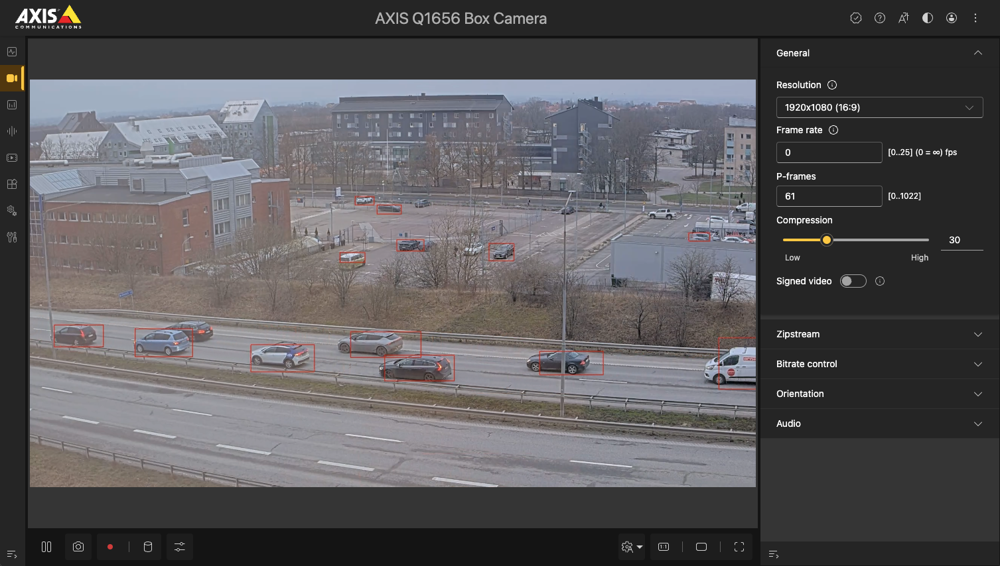

*Copyright (C) 2021, Axis Communications AB, Lund, Sweden. All Rights Reserved.*
<!-- omit from toc -->
# Object Detection Example for SSD MobileNet v2 (COCO)

This example shows how to apply a pretrained SSD MobileNet v2 (COCO) object detection model on an Axis camera.
The model is downloaded through the Dockerfile from the [Google Coral](https://coral.ai/models/object-detection/) repository.

This example uses the following APIs:

- [Machine learning API (Larod)](https://developer.axis.com/acap/api/native-sdk-api/#machine-learning-api-larod)
- [Video capture API (VDO)](https://developer.axis.com/acap/api/native-sdk-api/#video-capture-api-vdo)
- [Bounding Box API](https://developer.axis.com/acap/api/native-sdk-api/#bounding-box-api)

Below is an example showing how the bounding boxes are drawn around the detected objects on the
stream.



## Project structure

The files for building the application are organized in the following structure.

```sh
object-detection
├── app
│   ├── argparse.c
│   ├── argparse.h
│   ├── imgprovider.c
│   ├── imgprovider.h
│   ├── labelparse.c
│   ├── labelparse.h
│   ├── LICENSE
│   ├── Makefile
│   ├── manifest.json.artpec8
│   ├── manifest.json.artpec9
│   ├── manifest.json.cpu
│   ├── manifest.json.edgetpu
│   ├── model.c
│   ├── model.h
│   ├── object_detection.c
│   ├── panic.c
│   ├── panic.h
├── Dockerfile
└── README.md
```

- **app/argparse.c/h** - Program argument parser.
- **app/imgprovider.c/h** - Implementation of VDO parts.
- **app/labelparse.c/h** - Parse file of labels.
- **app/LICENSE** - Text file which lists all open source licensed source code distributed with the
application.
- **app/Makefile** - Makefile containing the build and link instructions for building the ACAP
application.
- **app/manifest.json.artpec8** - Defines the application and its configuration when building for
ARTPEC-8 DLPU cameras with TensorFlow Lite.
- **app/manifest.json.artpec9** - Defines the application and its configuration when building for
ARTPEC-9 DLPU cameras with TensorFlow Lite.
- **app/manifest.json.cpu** - Defines the application and its configuration when building for
CPU with TensorFlow Lite.
- **app/manifest.json.edgetpu** - Defines the application and its configuration when building for
ARTPEC-7 DLPU (Using Google EdgeTPU) cameras with TensorFlow Lite.
- **app/object_detection.c** - Application source code in C.
- **app/model.c/h** - Implementation of Larod parts.
- **app/panic.c/h** - Utility for exiting the program on error.
- **Dockerfile** -  Assembles an image containing the ACAP Native SDK and builds the application using it.
- **README.md** - Step by step instructions on how to run the example.

<!-- omit from toc -->
## Table of contents

- [Project structure](#project-structure)
- [Outline of example](#outline-of-example)
- [ACAP application parameters](#acap-application-parameters)
  - [Dockerfile parameters](#dockerfile-parameters)
  - [Model-specific parameters](#model-specific-parameters)
- [Build the application](#build-the-application)
- [Install and start the application](#install-and-start-the-application)
- [Expected output](#expected-output)
  - [Application log](#application-log)
- [License](#license)

## Outline of example

1. Load the model using [Larod](https://developer.axis.com/acap/api/native-sdk-api/#machine-learning-api-larod)
to determine the width and height and the number of output tensors.
2. Create a stream from [VDO](https://developer.axis.com/acap/api/native-sdk-api/#video-capture-api-vdo) in order to get frames that can be sent to Larod for inference.
3. A Larod model inference job is created. If the image provided by VDO doesn't match the input format or resolution needed for the inference job, a pre-processing job is also created.
4. Setup the style of bounding boxes using the
[Bounding Box API](https://developer.axis.com/acap/api/native-sdk-api/#bounding-box-api).
5. Run the main program loop:
    1. Fetch image data from VDO.
    2. If needed, convert image data to the correct format with the Larod pre-processing job.
    3. Run inference with the Larod model inference job.
    4. Perform MobileNet SSD V2 (Coco) parsing of the output.
    5. Measure the total inference time (preprocessing, inference and postprocessing time) and adjust the framerate of the vdo stream if needed.
    6. Draw bounding boxes and log details about the detected objects.

## ACAP application parameters

### Dockerfile parameters

The model `.tflite` file and the labels `.txt` file are provided through the `Dockerfile`. In this
example, these files are downloaded using the `curl` command.

### Model-specific parameters

The below arguments are passed to the program via the `manifest.json` file. Note that the paths to **MODEL** and **LABELSFILE** should be passed according to their location on the device.

- **MODEL** - The location of the model file (Mandatory).
- **THRESHOLD** - Threshold if a detection should be displayed using Bbox.
- **LABELSFILE** - The path to the labels txt file.

## Build the application

Standing in your working directory run the following commands:

> [!NOTE]
>
> - Depending on the network your local build machine is connected to, you may need to add proxy
> settings for Docker. See
> [Proxy in build time](https://developer.axis.com/acap/develop/proxy).
>

```sh
docker build --platform=linux/amd64 --tag <APP_IMAGE> --build-arg ARCH=<ARCH> --build-arg CHIP=<CHIP> .
```

- `<APP_IMAGE>` is the name to tag the image with, e.g., `object_detection:1.0`.
- `<ARCH>` is the SDK architecture, `armv7hf` or `aarch64`.
- `<CHIP>` is the chip type, `artpec9`, `artpec8`, `cpu` or `edgetpu`

Copy the result from the container image to a local directory `build`:

```sh
docker cp $(docker create --platform=linux/amd64 <APP_IMAGE>):/opt/app ./build
```

The `build` directory contains the build artifacts, where the ACAP application is found with suffix
`.eap`, depending on ARTPEC-8, ARTPEC-9, edgetpu or CPU:

- `object_detection_artpec8_1_0_0_<ARCH>.eap`.
- `object_detection_artpec9_1_0_0_<ARCH>.eap`.
- `object_detection_cpu_1_0_0_<ARCH>.eap`.
- `object_detection_edgetpu_1_0_0_<ARCH>.eap`.

> [!NOTE]
>
> For detailed information on how to build, install, and run ACAP applications, refer to the official ACAP documentation: [Build, install, and run](https://developer.axis.com/acap/develop/build-install-run/).

## Install and start the application

Browse to the application page of the Axis device:

```sh
http://<AXIS_DEVICE_IP>/index.html#apps
```

- Click on the tab `Apps` in the device GUI
- Enable `Allow unsigned apps` toggle
- Click `(+ Add app)` button to upload the application file
- Browse to the newly built ACAP application:
  - `object_detection_<CHIP>_1_0_0_<ARCH>.eap`
- Click `Install`
- Run the application by enabling the `Start` switch

## Expected output

This example uses the
[Bounding Box API](https://developer.axis.com/acap/api/native-sdk-api/#bounding-box-api)
to visualize the output from the SSD MobileNet v2 model. With the Bounding Box API, it is possible to draw
bounding boxes directly on the device stream. View the stream by following the instructions:

1. Click on the tab `Video` in the device GUI.
2. Click `Stream` in the drop down menu.

> [!NOTE]
>
> When detecting fast moving objects, the bounding box might lag behind the object depending on how
> long the pre-processing and inference time is.

### Application log

The application log can be found by either:

- Browsing to `http://<AXIS_DEVICE_IP>/axis-cgi/admin/systemlog.cgi?appname=object_detection`.
- Browsing to the application page and click the `App log`.

```sh
tail -f /var/volatile/log/info.log | grep object_detection
```

Depending on selected chip, different output is received. The label file is used for identifying objects.

There are four outputs from SSD MobileNet v2 (COCO) model. The number of detections, classes, scores, and locations are shown as below. The four location numbers stand for \[top, left, bottom, right\].

```sh
[ INFO    ] object_detection[645]: Object 0: Classes: 2 car - Scores: 0.769531 - Locations: [0.750146,0.086451,0.894765,0.299347]
[ INFO    ] object_detection[645]: Object 1: Classes: 2 car - Scores: 0.335938 - Locations: [0.005453,0.101417,0.045346,0.144171]
[ INFO    ] object_detection[645]: Object 2: Classes: 2 car - Scores: 0.308594 - Locations: [0.109673,0.005128,0.162298,0.050947]
```

The detected objects with a score higher than a threshold will be drawn using bbox and logged.

## License

**[Apache License 2.0](../LICENSE)**
