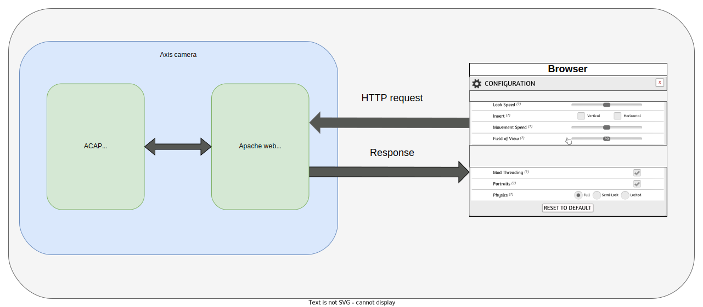

*Copyright (C) 2022, Axis Communications AB, Lund, Sweden. All Rights Reserved.*

# How to integrate the device's Apache web server in an ACAP application

This guide explains how to build an ACAP application that can handle HTTP requests sent to the Axis device. The application uses [FastCGI](https://fastcgi-archives.github.io/FastCGI_A_High-Performance_Web_Server_Interface_FastCGI.html) to handle the request and response, and [uriparser](https://uriparser.github.io/) to parse the received query parameters.
This example addresses a similar problem as the [web-server](../web-server) example but it is better integrated with the Axis device. It builds upon the Apache web server that is already present in the Axis device, eliminating the need for running an additional web server.
By utilizing the built-in web server, the API can be exposed on the same port as VAPIX. Users are authenticated in the same manner as when using VAPIX and the user pool is the same, providing significant advantages compared to the [web-server](../web-server) example.

## Use case

The FastCGI integration with the device's Apache web server can be used for:

- Serving web pages, e.g. the ACAP application settings
- Exposing a HTTP API
- Displaying application output



## Getting started

These instructions will guide you on how to execute the code. Below is the structure and scripts used in the example:

```sh
using-fastcgi
├── app
│   ├── fastcgi_example.c
│   ├── LICENSE
│   ├── Makefile
│   └── manifest.json
├── Dockerfile
└── README.md
```

- **app/fastcgi_example.c** - The application running FastCGI code.
- **app/LICENSE** - Text file which lists all open source licensed source code distributed with the application.
- **app/Makefile** - Makefile containing the build and link instructions for building the ACAP application.
- **app/manifest.json** - Defines the application and its FastCGI configuration.
- **Dockerfile** - Docker file with the specified Axis toolchain and API container to build the example specified.
- **README.md** - Step by step instructions on how to run the example.

### Manifest schema HTTP configuration

To correctly set up an application that integrates with the Apache web server it is necessary to add some special configuration in the `app/manifest.json` file following the [manifest schema](https://developer.axis.com/acap/develop/manifest-schemas/).

```json
"acapPackageConf": {
  "configuration": {
    "httpConfig": [
        {
            "access": "viewer",
            "name": "example.cgi",
            "type": "fastCgi"
        }
    ]
  }
}
```

- **type** - CGI implementation type. It can assume the values `transferCgi`, `fastCgi`.
- **name** - CGI path relative to the application web root. Any alphanumeric string is allowed.
- **access** - Access policy for calling the CGI. It can assume the values `admin`, `viewer`, `operator`.

### How to run the code

Below is the step by step instructions on how to execute the program. So basically starting with the generation of the .eap file to running it on a device.

#### Build the application

Standing in your working directory run the following commands:

> [!NOTE]
>
> Depending on the network your local build machine is connected to, you may need to add proxy
> settings for Docker. See
> [Proxy in build time](https://developer.axis.com/acap/develop/proxy/#proxy-in-build-time).

```sh
docker build --platform=linux/amd64 --tag <APP_IMAGE> .
```

`<APP_IMAGE>` is the name to tag the image with, e.g., `using_fastcgi:1.0`.

Default architecture is **armv7hf**. To build for **aarch64** it's possible to
update the *ARCH* variable in the Dockerfile or to set it in the `docker build`
command via build argument:

```sh
docker build --build-arg ARCH=aarch64 --tag <APP_IMAGE> .
```

Copy the result from the container image to a local directory called `build`:

```sh
docker cp $(docker create --platform=linux/amd64 <APP_IMAGE>):/opt/app ./build
```

The working directory now contains a build folder with the following files:

```sh
build
├── LICENSE
├── Makefile
├── manifest.json
├── package.conf
├── package.conf.orig
├── param.conf
├── fastcgi_example*
├── fastcgi_example_1_0_0_armv7hf.eap
├── fastcgi_example_1_0_0_LICENSE.txt
└── fastcgi_example.c
```

- **manifest.json** - Defines the application and its configuration.
- **package.conf** - Defines the application and its configuration.
- **package.conf.orig** - Defines the application and its configuration, original file.
- **param.conf** - File containing application parameters.
- **fastcgi_example*** - Application executable binary file.
- **fastcgi_example_1_0_0_armv7hf.eap** - Application package .eap file.
- **fastcgi_example_1_0_0_LICENSE.txt** - Copy of LICENSE file.

> [!NOTE]
>
> For detailed information on how to build, install, and run ACAP applications, refer to the official ACAP documentation: [Build, install, and run](https://developer.axis.com/acap/develop/build-install-run/).

#### Install and start the application

Browse to the application page of the Axis device:

```sh
http://<AXIS_DEVICE_IP>/index.html#apps
```

- Click on the tab `Apps` in the device GUI
- Enable `Allow unsigned apps` toggle
- Click `(+ Add app)` button to upload the application file
- Browse to the newly built ACAP application, depending on architecture:
  - `fastcgi_example_1_0_0_aarch64.eap`
  - `fastcgi_example_1_0_0_armv7hf.eap`
- Click `Install`
- Run the application by enabling the `Start` switch

#### The expected output

The output of your application can be seen visiting the URL `http://<AXIS_DEVICE_IP>/local/fastcgi_example/example.cgi?name=Axis`. You should see an output like this:

```text
Hello Axis from FastCGI
Request number 2
URI: /local/fastcgi_example/example.cgi?name=Axis
KEY, ITEM:
name, Axis
```

The output to the system log in this example is just for debugging.

## License

**[Apache License 2.0](../LICENSE)**

## References

- <https://uriparser.github.io/>
